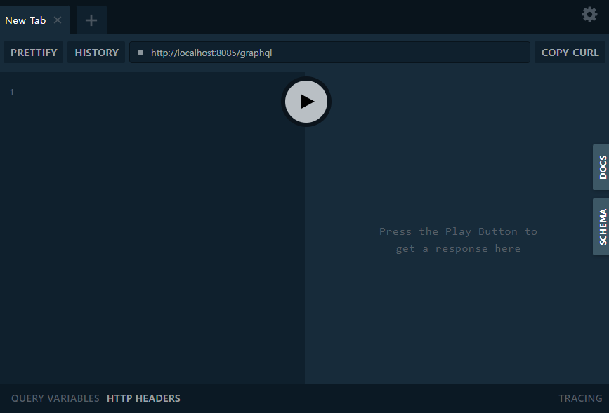
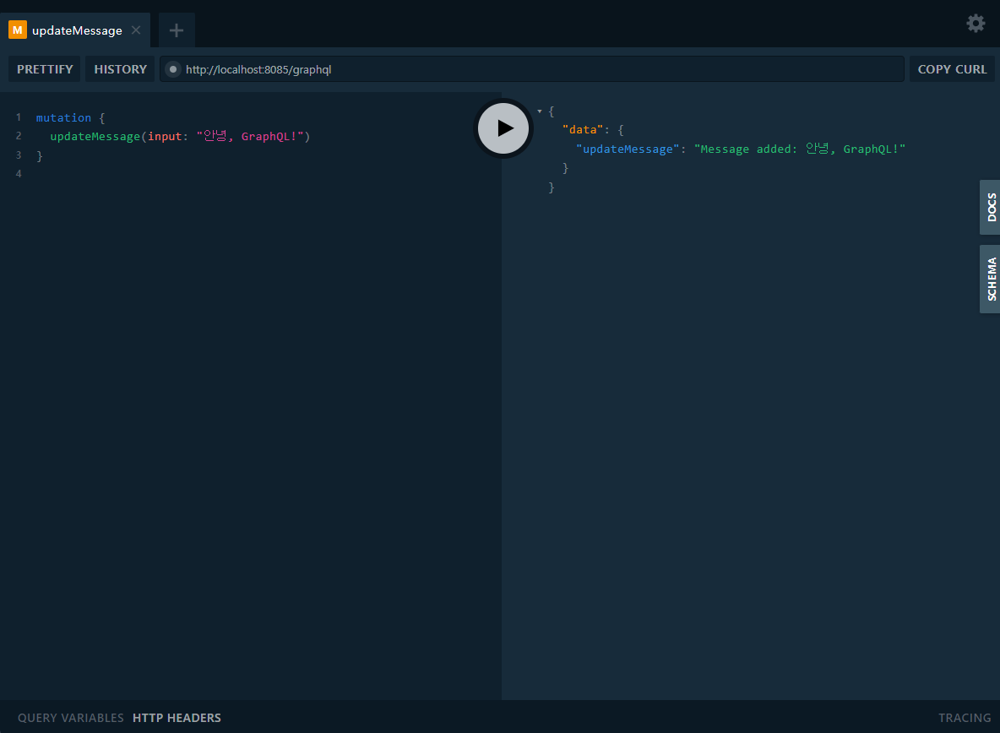
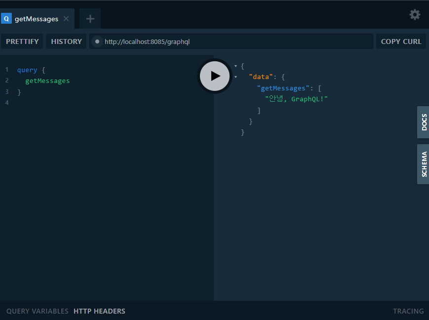
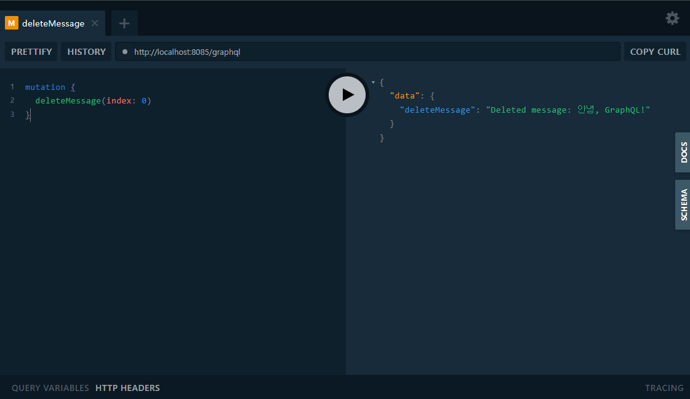

# GraphQL-Go 메시지 관리 서비스

이 프로젝트는 **`graphql-go`** 라이브러리를 사용하여 간단한 메시지 관리 API를 제공합니다. 이 API는 메시지를 추가, 삭제, 조회할 수 있는 기능을 제공합니다.  
`Go`로 GraphQL 서버를 구현하는 예제로 활용할 수 있습니다.

---

## 기능

### Queries
1. **`hello`**
    - 간단한 테스트 쿼리로, `"Hello, graphql-go!"` 메시지를 반환합니다.

2. **`getMessages`**
    - 저장된 모든 메시지를 배열 형태로 반환합니다.

### Mutations
1. **`updateMessage(input: String!)`**
    - 새로운 메시지를 추가합니다.
    - **Args**:
        - `input`: 추가할 메시지 (필수)

2. **`deleteMessage(index: Int!)`**
    - 특정 인덱스의 메시지를 삭제합니다.
    - **Args**:
        - `index`: 삭제할 메시지의 인덱스 (필수)

---

## 설치 및 실행 방법

### 1. 의존성 설치
아래 명령어를 실행하여 프로젝트에 필요한 패키지를 설치합니다:
```bash
go get github.com/graphql-go/graphql
go get github.com/graphql-go/handler
```

### 2. 서버 실행
```bash
go run main.go
```

### 3. GraphQL Playground 접속
브라우저에서 [http://localhost:8085/graphql](http://localhost:8085/graphql)로 접속하여 GraphQL 쿼리 및 Mutation을 테스트합니다.

---

## 사용 예제

### 1. `hello` 쿼리
**요청**:
```graphql
query {
  hello
}
```

**결과**:
```json
{
  "data": {
    "hello": "Hello, graphql-go!"
  }
}
```

---

### 2. `getMessages` 쿼리
#### 저장된 메시지가 없는 경우:
**요청**:
```graphql
query {
  getMessages
}
```

**결과**:
```json
{
  "data": {
    "getMessages": []
  }
}
```

#### 메시지가 저장된 경우:
**요청**:
```graphql
query {
  getMessages
}
```

**결과**:
```json
{
  "data": {
    "getMessages": ["Hello World", "GraphQL is powerful!"]
  }
}
```

---

### 3. `updateMessage` Mutation
**요청**:
```graphql
mutation {
  updateMessage(input: "Hello World!")
}
```

**결과**:
```json
{
  "data": {
    "updateMessage": "Message added: Hello World!"
  }
}
```

---

### 4. `deleteMessage` Mutation
**요청**:
```graphql
mutation {
  deleteMessage(index: 0)
}
```

**결과 (성공)**:
```json
{
  "data": {
    "deleteMessage": "Deleted message: Hello World!"
  }
}
```

**결과 (실패 - 잘못된 인덱스)**:
```json
{
  "errors": [
    {
      "message": "invalid index: 5",
      "locations": [
        {
          "line": 2,
          "column": 3
        }
      ]
    }
  ],
  "data": null
}
```

---

## 스크린샷

### 1. GraphQL Playground 메인 화면


### 2. `updateMessage` 테스트


### 3. `getMessages` 테스트


### 4. `deleteMessage` 테스트


---

## 추가 고려 사항

- **확장 가능성**:
    - 이 코드는 메시지 관리의 기본 기능만 제공하므로, 실시간 기능(예: Subscription)이나 데이터베이스 연동을 추가하여 확장할 수 있습니다.

- **테스트 케이스**:
    - 기본 기능의 유효성을 검증하기 위해 Go의 `testing` 패키지를 활용해 테스트를 작성할 것을 추천합니다.

---

## 라이선스

이 프로젝트는 MIT 라이선스를 따릅니다.

---

## 기여

- 버그를 발견하거나 개선할 점이 있다면 이슈를 제출해주세요!
- Pull Request도 환영합니다. 😊
